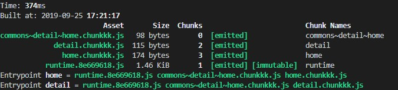

# Webpack 学习文档

> 推荐资料：
>
> - [Webpack从入门到上线](https://www.cnblogs.com/yincheng/p/webpack.html)
> - [基于 Webpack4 搭建 Vue 开发环境](https://juejin.im/post/5bc30d5fe51d450ea1328877)
> - [Webpack中文文档](https://webpack.docschina.org/concepts/)
> - [Webpack 4 配置最佳实践](https://juejin.im/post/5b304f1f51882574c72f19b0)
> - [带你走进webpack世界](https://juejin.im/post/5ac9dc9af265da23884d5543)
> - [Webpack 理解 Chunk](https://juejin.im/post/5d2b300de51d45775b419c76)

## 一、安装

1. 确保电脑上安装有 node 环境且 npm 命令可用。
2. 新建文件夹，使用`npm init`新建项目
3. 使用`npm install -g webpack webpack-cli`安装 webpack 命令
4. 项目文件夹下执行`npm install webpack webpack-cli --save-dev`进行项目脚手架安装

## 二、基础打包

1. 新建**webpack.config.js**文件，加入基础配置项目，进行 JS 打包
2. 在项目文件下执行`webpack`命令，即可以看到生成的打包文件在 dist 文件夹下

## 三、使用 webpack-dev-server 打造开发环境

1. 项目文件夹下执行`npm install webpack-dev-server --save-dev`安装环境
2. 执行`npm install -g webpack-dev-server`安装命令环境
3. 项目文件夹下执行`webpack-dev-server`即可通过访问*127.0.0.1:8080*（默认端口为 8080，可以通过 --port 参数进行修改）访问当前文件夹
4. 新版的 webpack-dev-server 自带热更新，任何修改都会导致服务重启

## 四、Webpack 4 配置初解

前三步完成后，一个基础的 Webpack 项目就可以说已经搭起来了，接下来，我们以当前的 webpack.config.js 为例，介绍一个基础的配置文件中包含了什么。

```javascript
const path = require('path')

module.exports = {
  // The standard entry point and output config
  // 每个页面的js文件
  entry: {
    home: './src/js/home',
    detail: './src/js/detail'
  },
  output: {
    path: path.resolve(__dirname, 'dist'), // 打包输出目录
    filename: '[name].[hash:8].js', // 输出文件名
  }
}
```

- entry 项代表入口，webpack 会从该项开始找文件开始解析并打包，每一个子项都会产生一个**chunk**（代码块），chunk 的名字就是每一项的 key 值。
- output 代表的是输出文件的配置，其中 path 代表了打包的输出目录，filename 则是输出文件的名字，其中 [name] 指的是 **chunk** 的名字，[hash:8] 表示根据当前版本生成的 hash 码的前八位。

### 4.1 Chunk

上面的配置项反复提到了一个词**Chunk**，代码块。这个概念是入门 Webpack 的一个重要概念。

**Chunk 是 WebPack 打包过程中，一堆 module 的集合**。

什么是 module 呢？Webpack 在打包所有文件时，其实都会根据**文件后缀名**把文件视为分为个个 module ，比如 css 文件就属于 CSS Module，这也就是为什么 webpack 中有一个 module 选项，可以配置 rules 用于决定哪个 module 应用哪种 loader。

```javascript
// config
{
    module: {
        rules: [
          {
            test: /\.css$/,
            use: [
              {
                loader: "style-loader"
              }, {
                loader: "css-loader"
              }
            ]
          },
          // ...
        ]
      }
}
```

Webpack 通过入口文件开始，通过引用关系（require、import）挨个打包模块，最终形成的就是 Chunk。

如果我们有多个入口文件，就会有可能形成多个 Chunk，除了 entry 可以形成多个 chunk 以外，还有其余的两种途径。

#### 4.2 产生 Chunk 的多种方式

1. 通过 entry 配置

   entry 配置项可以接收三种值（以下讨论情况不涉及代码分割）：

   - 字符串，这种情况下只会产生一个 Chunk

   - 数组，如`entry: ['./src/js/main.js', './src/js/other.js']`，这种情况下也只会生成一个Chunk

   - 对象，如上面的示例代码。

     这种情况下对象中的一个字段就会产生一个 Chunk ，**所以在这种情况下 output 中的 filename 不可直接写死，否则会报错**。因为产生了两个 Bundle 一个名称必然不够用，需要用 [name] 变量来作为生成 Bundle 们的名称。

     而 entry 对象中的 key，也会被用来当作它对应的 Chunk 的名称。

2. 异步产生 Chunk

   除了入口文件会影响以外，异步加载的模块也需要生成 Chunk

   ```javascript
   // test.js
   import('./myModule')
   module.exports = {
     hi: 123
   }
   ```

3. 代码分割产生 Chunk

   请问以下的配置文件会产生多少个Chunk？

   ```javascript
   const path = require('path')
   
   module.exports = {
     // The standard entry point and output config
     // 每个页面的js文件
     entry: {
       home: './src/js/home',
       detail: './src/js/detail'
     },
     output: {
       path: path.resolve(__dirname, 'dist'), // 打包输出目录
       filename: '[name].[hash:8].js', // 输出文件名
       chunkFilename: '[name].chunkkk.js',
     },
     optimization: {
       runtimeChunk: 'single',
       splitChunks: {
         cacheGroups: {
           commons: {
             chunks: 'initial',
             minChunks: 2,
             maxInitialRequests: 5,
             minSize: 0
           }
         }
       }
     }
   }
   ```

   ```javascript
   // home.js
   var test = require('./test')
   var myModule = require('./myModule')
   
   console.log(test)
   console.log(myModule)
   ```

   ```javascript
   // detail.js
   var test = require('./test')
   console.log(test)
   ```

   答案是 4 个。

   

   其中两个入口文件 home.js 和 detail.js 分别产生一个， runtimeChunk: "single" 会将Webpack在浏览器端运行时需要的代码单独抽离到一个文件，commons 下的配置会产生一个 Chunk，一共是 4 个。

#### 4.3 Chunk 和 Bundle 概念异同

Bundle 是我们最终输出的一个或多个文件（简单来说就是最后生成的文件数量），它的概念与 Chunk 不同。大多数情况下，一个 Chunk 会生成一个 Bundle，但也有不是一对一的情况，比如说下面这样的配置：

```javascript
{
     entry: {
    	main: __dirname + "/app/main.js",
     },
     output: {
        path: __dirname + "/public",//打包后的文件存放的地方
        filename: "[name].js", //打包后输出文件的文件名
      },
     devtool: 'source-map'
}
```

这种情况下只会产生一个Chunk，但是会产生两个Bundle。

可以说，Chunk是过程中的代码块，Bundle是结果的代码块。