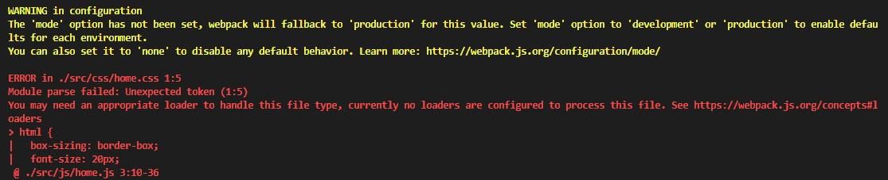
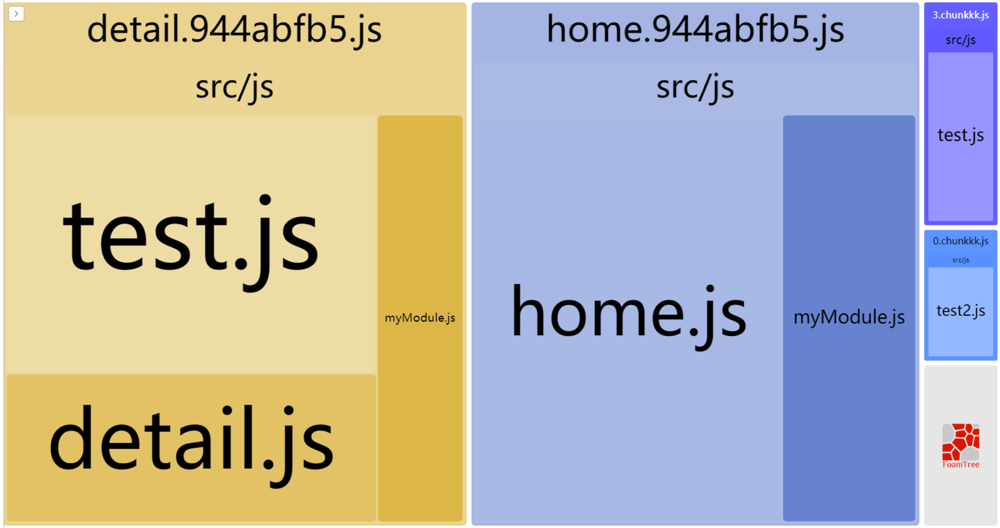
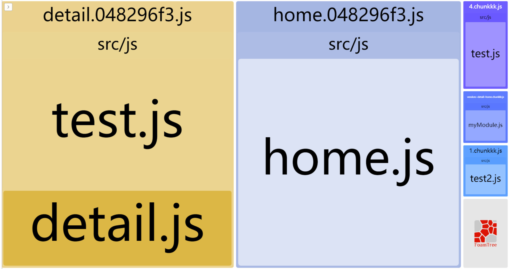
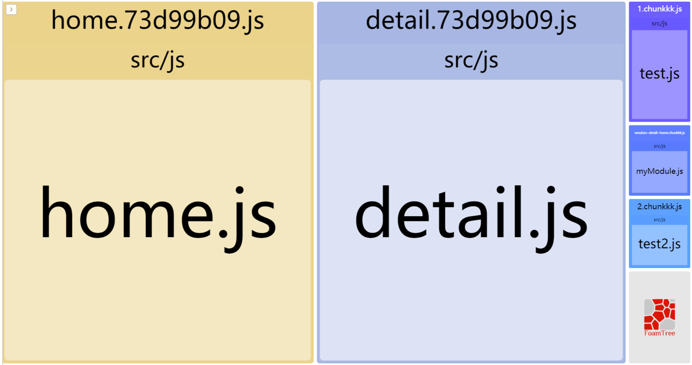
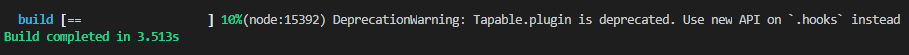
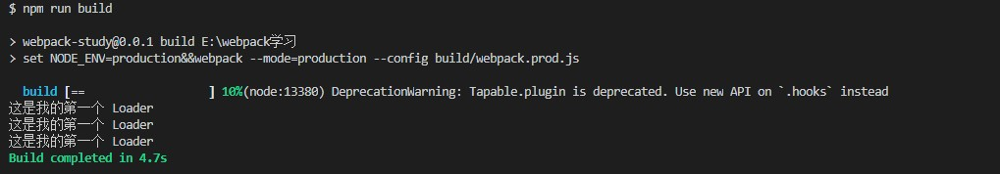

# Webpack 学习文档

> 推荐资料：
>
> - [gulp和webpack究竟有什么区别？](https://segmentfault.com/q/1010000008058766)
> - [Gulp和Webpack的基本区别](https://www.qingtingip.com/h_199804.html)
> - [Webpack中文文档](https://webpack.docschina.org/concepts/)
> - [Webpack从入门到上线](https://www.cnblogs.com/yincheng/p/webpack.html)
> - [Webpack 4 配置最佳实践](https://juejin.im/post/5b304f1f51882574c72f19b0)
> - [带你走进webpack世界](https://juejin.im/post/5ac9dc9af265da23884d5543)
> - [Webpack 理解 Chunk](https://juejin.im/post/5d2b300de51d45775b419c76)
> - [webpack build后生成的app、vendor、manifest三者有何职能不同？](https://juejin.im/post/5c17b9805188251e663ec239)
> - [[译]Webpack 4 — 神秘的SplitChunksc插件](https://juejin.im/post/5b45abde51882519ba0044d0)
> - [webpack踩坑之路 (2)——图片的路径与打包](https://www.cnblogs.com/ghost-xyx/p/5812902.html)
> - [webpack4.0+vue+es6配置](https://juejin.im/post/5c68f4e9e51d454be11473b9)
> - [webpack4.x下babel的安装、配置及使用](https://blog.csdn.net/u012443286/article/details/79577545)
> - [深入Webpack-编写Loader](https://segmentfault.com/a/1190000012718374)
> - [webpack loader和plugin编写](https://juejin.im/post/5bbf190de51d450ea52fffd3)
> - [webpack自定义插件](https://zxljack.com/2019/03/webpack-plugin/)

   * [<span style="font-size: 2em;font-weight: bold;">Webpack 学习文档目录</span>](#webpack-学习文档)
      * [一、安装](#一安装)
      * [二、基础打包](#二基础打包)
      * [三、使用 webpack-dev-server 打造开发环境](#三使用-webpack-dev-server-打造开发环境)
      * [四、Webpack 4 配置初解](#四webpack-4-配置初解)
         * [4.1 Chunk](#41-chunk)
            * [4.2 产生 Chunk 的多种方式](#42-产生-chunk-的多种方式)
            * [4.3 Chunk 和 Bundle 概念异同](#43-chunk-和-bundle-概念异同)
      * [五、打包除了 JS 以外的文件](#五打包除了-js-以外的文件)
         * [5.1 打包html](#51-打包html)
         * [5.2 打包 CSS](#52-打包-css)
      * [六、代码分割](#六代码分割)
         * [6.1 使用插件分析打包模块](#61-使用插件分析打包模块)
         * [6.2 代码分割配置详解](#62-代码分割配置详解)
            * [6.2.3 三种不同的分割逻辑](#623-三种不同的分割逻辑)
      * [额外优化](#额外优化)
      * [七、WebPack 项目基本配置](#七webpack-项目基本配置)
         * [7.1 区分生产开发环境](#71-区分生产开发环境)
         * [7.2 开发环境配置](#72-开发环境配置)
         * [7.3 生产环境配置](#73-生产环境配置)
      * [八、资源管理插件-loader](#八资源管理插件-loader)
      * [九、Vue 环境相关开发配置](#九vue-环境相关开发配置)
      * [十、项目的额外优化](#十项目的额外优化)
         * [10.1 babel -loader 配置](#101-babel--loader-配置)
         * [10.2 小工具](#102-小工具)
      * [十一、编写 Loader](#十一编写-loader)
         * [11.1 Loader 基础以及使用](#111-loader-基础以及使用)
         * [11.2 Loader API 功能](#112-loader-api-功能)
            * [11.2.1 获得 Loader 的 options](#1121-获得-loader-的-options)
            * [11.2.2 返回其它结果](#1122-返回其它结果)
            * [11.2.3 同步与异步](#1123-同步与异步)
            * [11.2.4 处理二进制数据](#1124-处理二进制数据)
            * [11.2.5 缓存加速](#1125-缓存加速)
            * [11.2.6 其余常用 API](#1126-其余常用-api)
      * [十二、编写 Plugin](#十二编写-plugin)
         * [12.1 Plugin 示例](#121-plugin-示例)
         * [12.1 Plugin 涉及概念](#121-plugin-涉及概念)
         * [12.1 Plugin 执行流程](#121-plugin-执行流程)
         * [12.2 手写一个骨架屏插件 Demo](#122-手写一个骨架屏插件-demo)

---

第一部分 基础学习

---

## 一、安装

1. 确保电脑上安装有 node 环境且 npm 命令可用。
2. 新建文件夹，使用`npm init`新建项目
3. 使用`npm install -g webpack webpack-cli`安装 webpack 命令
4. 项目文件夹下执行`npm install webpack webpack-cli --save-dev`进行项目脚手架安装

## 二、基础打包

1. 新建**webpack.config.js**文件，加入基础配置项目，进行 JS 打包
2. 在项目文件下执行`webpack`命令，即可以看到生成的打包文件在 dist 文件夹下

## 三、使用 webpack-dev-server 打造开发环境

1. 项目文件夹下执行`npm install webpack-dev-server --save-dev`安装环境
2. 执行`npm install -g webpack-dev-server`安装命令环境
3. 项目文件夹下执行`webpack-dev-server`即可通过访问*127.0.0.1:8080*（默认端口为 8080，可以通过 --port 参数进行修改）访问当前文件夹
4. 新版的 webpack-dev-server 自带热更新，任何修改都会导致服务重启

## 四、Webpack 4 配置初解

前三步完成后，一个基础的 Webpack 项目就可以说已经搭起来了，接下来，我们以当前的 webpack.config.js 为例，介绍一个基础的配置文件中包含了什么。

```javascript
const path = require('path')

module.exports = {
  // The standard entry point and output config
  // 每个页面的js文件
  entry: {
    home: './src/js/home',
    detail: './src/js/detail'
  },
  output: {
    path: path.resolve(__dirname, 'dist'), // 打包输出目录
    filename: '[name].[hash:8].js', // 输出文件名
  }
}
```

- entry 项代表入口，webpack 会从该项开始找文件开始解析并打包，每一个子项都会产生一个**chunk**（代码块），chunk 的名字就是每一项的 key 值。
- output 代表的是输出文件的配置，其中 path 代表了打包的输出目录，filename 则是输出文件的名字，其中 [name] 指的是 **chunk** 的名字，[hash:8] 表示根据当前版本生成的 hash 码的前八位。

### 4.1 Chunk

上面的配置项反复提到了一个词**Chunk**，代码块。这个概念是入门 Webpack 的一个重要概念。

**Chunk 是 WebPack 打包过程中，一堆 module 的集合**。

什么是 module 呢？Webpack 在打包所有文件时，其实都会根据**文件后缀名**把文件视为分为个个 module ，比如 css 文件就属于 CSS Module，这也就是为什么 webpack 中有一个 module 选项，可以配置 rules 用于决定哪个 module 应用哪种 loader。

```javascript
// config
{
    module: {
        rules: [
          {
            test: /\.css$/,
            use: [
              {
                loader: "style-loader"
              }, {
                loader: "css-loader"
              }
            ]
          },
          // ...
        ]
      }
}
```

Webpack 通过入口文件开始，通过引用关系（require、import）挨个打包模块，最终形成的就是 Chunk。

如果我们有多个入口文件，就会有可能形成多个 Chunk，除了 entry 可以形成多个 chunk 以外，还有其余的两种途径。

#### 4.2 产生 Chunk 的多种方式

1. 通过 entry 配置

   entry 配置项可以接收三种值（以下讨论情况不涉及代码分割）：

   - 字符串，这种情况下只会产生一个 Chunk

   - 数组，如`entry: ['./src/js/main.js', './src/js/other.js']`，这种情况下也只会生成一个Chunk

   - 对象，如上面的示例代码。

     这种情况下对象中的一个字段就会产生一个 Chunk ，**所以在这种情况下 output 中的 filename 不可直接写死，否则会报错**。因为产生了两个 Bundle 一个名称必然不够用，需要用 [name] 变量来作为生成 Bundle 们的名称。

     而 entry 对象中的 key，也会被用来当作它对应的 Chunk 的名称。

2. 异步产生 Chunk

   除了入口文件会影响以外，异步加载的模块也需要生成 Chunk

   ```javascript
   // test.js
   import('./myModule')
   module.exports = {
     hi: 123
   }
   ```

3. 代码分割产生 Chunk

   请问以下的配置文件会产生多少个Chunk？

   ```javascript
   const path = require('path')
   
   module.exports = {
     // The standard entry point and output config
     // 每个页面的js文件
     entry: {
       home: './src/js/home',
       detail: './src/js/detail'
     },
     output: {
       path: path.resolve(__dirname, 'dist'), // 打包输出目录
       filename: '[name].[hash:8].js', // 输出文件名
       chunkFilename: '[name].chunkkk.js',
     },
     optimization: {
       runtimeChunk: 'single',
       splitChunks: {
         cacheGroups: {
           commons: {
             chunks: 'initial',
             minChunks: 2,
             maxInitialRequests: 5,
             minSize: 0
           }
         }
       }
     }
   }
   ```

   ```javascript
   // home.js
   var test = require('./test')
   var myModule = require('./myModule')
   
   console.log(test)
   console.log(myModule)
   ```

   ```javascript
   // detail.js
   var test = require('./test')
   console.log(test)
   ```

   答案是 4 个。

   

   其中两个入口文件 home.js 和 detail.js 分别产生一个， runtimeChunk: "single" 会将Webpack在浏览器端运行时需要的代码单独抽离到一个文件，commons 下的配置会产生一个 Chunk，一共是 4 个。

#### 4.3 Chunk 和 Bundle 概念异同

Bundle 是我们最终输出的一个或多个文件（简单来说就是最后生成的文件数量），它的概念与 Chunk 不同。大多数情况下，一个 Chunk 会生成一个 Bundle，但也有不是一对一的情况，比如说下面这样的配置：

```javascript
{
     entry: {
    	main: __dirname + "/app/main.js",
     },
     output: {
        path: __dirname + "/public",//打包后的文件存放的地方
        filename: "[name].js", //打包后输出文件的文件名
      },
     devtool: 'source-map'
}
```

这种情况下只会产生一个Chunk，但是会产生两个Bundle。

可以说，Chunk是过程中的代码块，Bundle是结果的代码块。

## 五、打包除了 JS 以外的文件

直到上一个 Tag 为止，我们在做的一直都是 JS 的打包，而 Webpack 能做的显然不止于此。通过 Webpack 的插件配置，我们能为 Webpack 添加更多支持的打包类型。

### 5.1 打包html

引入 [html-webpack-plugin](https://github.com/jantimon/html-webpack-plugin) 用于实现这一目标。

```shell
npm install html-webpack-plugin@next --save-dev
```

该插件可以给每一个chunk生成html,指定一个`template`,可以接收参数，在模板里面使用。

随后在 webpack.config.js 中引入，执行`npm run build`，该插件就会最终生成一个引用了所有 JS 文件和 CSS 文件的 index.html 了。

```javascript
// webpack.config.js
const HtmlWebpackPlugin = require('html-webpack-plugin')
{
    plugins: [
        new HtmlWebpackPlugin()
    ]
}
```

我们还可以传入更多参数来进行自定义定制：

```javascript
// webpack.config.js
const path = require('path')
const { CleanWebpackPlugin } = require('clean-webpack-plugin')
const HtmlWebpackPlugin = require('html-webpack-plugin')

module.exports = {
  // The standard entry point and output config
  // 每个页面的js文件
  entry: {
    home: './src/js/home',
    detail: './src/js/detail'
  },
  output: {
    path: path.resolve(__dirname, 'dist'), // 打包输出目录
    filename: '[name].[hash:8].js', // 输出文件名
    chunkFilename: '[name].chunkkk.js'
  },
  plugins: [
    new CleanWebpackPlugin(),
    new HtmlWebpackPlugin({
      template: './src/html/home.html',
      filename: 'home.html',
      title: 'home',
      chunks: ['home'],
      hash: true,
      minify: {
        removeAttributeQuotes: true
      }
    }),
    new HtmlWebpackPlugin({
      template: './src/html/detail.html',
      filename: 'detail.html',
      title: 'detail',
      chunks: ['detail'],
      hash: true,
      minify: {
        removeAttributeQuotes: true
      }
    })
  ]
}
```

在webpack中，插件的引入顺序没有规定，上面的例子中我们引入了两个 html 模板，且每个 html 都有自己所属的 Chunk 包，打包配置含义如下：

- template: html 模板的路径地址
- filename: 生成的文件名
- title：传入的参数
- chunks：html 文件所需要引入的 chunk，这里传入的是一个由 chunk 的 key 值组成的数组，chunk 的 key 值正如上文所述就是 entry 选项中对象的 key 值。
- hash：在引入的 JS 里面加入 hash 值，用于区分版本避免缓存后无法更新，比如`<script src="detail.4f7295dc.js?4f7295dc91c265ce0b3d"></script>`这种形式
- removeAttributeQuotes：去掉引号，减小文件大小

### 5.2 打包 CSS

要让 webpack 在打包 JS 的时候同时打包 CSS，首先要让 webpack 能够识别到 CSS，否则就会像下面这样报错。

```javascript
// home.js
var test = require('./test')
var myModule = require('./myModule')
var css = require('../css/home.css') // 通过 require 引入 CSS

console.log(test)
console.log(myModule)
```



安装 css-loader 拓展即可让 webpack 在打包时识别到 css 文件。安装 style-loader 可以让 Webpack 将引入的 CSS 加上 style 标签用 JS 自动生成在页面里。

```shell
# 执行安装
npm install css-loader style-loader --save-dev
```

```javascript
// webpack.config.js
const path = require('path')
const { CleanWebpackPlugin } = require('clean-webpack-plugin')
const HtmlWebpackPlugin = require('html-webpack-plugin')

module.exports = {
  // The standard entry point and output config
  // 每个页面的js文件
  entry: {
    home: './src/js/home',
    detail: './src/js/detail'
  },
  output: {
    path: path.resolve(__dirname, 'dist'), // 打包输出目录
    filename: '[name].[hash:8].js', // 输出文件名
    chunkFilename: '[name].chunkkk.js'
  },
  module: {
    rules: [
      {
        test: /\.css$/,
        use: ['style-loader', 'css-loader'], // 被引入的 loader 会从右至左顺序执行，css-loader 用于支持 css 中的引入 , style-loader 用于 JS 把 css 写入 style 内嵌标签动态创建
        exclude: /node_modules/
      }
    ]
  },
  plugins: [
    new CleanWebpackPlugin()
  ]
}
```

当然，如果你想使用 stylus、scss 等编译型 CSS 语言，也可以引入相应的 loader ，比如 scss 类型的文件就可以引入下面类型的 loader。

```shell
npm install css-loader style-loader sass-loader node-sass -D
```

其中 node-sass 是 sass-loader 的依赖。

```javascript
module: {
    rules: [
      {
        test: /\.scss$/,
        use: ['style-loader', 'css-loader', 'sass-loader'], // 被引入的 loader 会从右至左顺序执行，css-loader 用于支持 css 中的引入 , style-loader 用于 JS 把 css 写入 style 内嵌标签动态创建
        exclude: /node_modules/
      }
    ]
  }
```

如果要把 css 作为一个单独的文件，需要用到一个插件：

```shell
npm i extract-text-webpack-plugin@next --save-dev
```

```javascript
// webpack.config.js
const path = require('path')
const { CleanWebpackPlugin } = require('clean-webpack-plugin')
const HtmlWebpackPlugin = require('html-webpack-plugin')
const ExtractTextPlugin = require('extract-text-webpack-plugin')

module.exports = {
  // The standard entry point and output config
  // 每个页面的js文件
  entry: {
    home: './src/js/home',
    detail: './src/js/detail'
  },
  output: {
    path: path.resolve(__dirname, 'dist'), // 打包输出目录
    filename: '[name].[hash:8].js', // 输出文件名
    chunkFilename: '[name].chunkkk.js'
  },
  module: {
    rules: [
      {
        test: /\.css$/,
        use: ExtractTextPlugin.extract({
          // style-loader 把 css 文件中的数据写入到 html 中的 style 标签
          fallback: 'style-loader',
          use: ['css-loader']
        }),
        exclude: /node_modules/
      }
    ]
  },
  plugins: [
    new CleanWebpackPlugin(),
    new ExtractTextPlugin('[name].[hash:8].css')
  ]
}
```

插件配置

- name: chunk 的名字
- hash: 8 根据内容生成 hash 值取前 8 位
- 修改 loader 配置下的 use，fallback 指兼容方案

## 六、代码分割

本节要研究的是 webpack 对于代码分割的机制，webpack 可以将多次 import 的文件根据一定的规则打包成一个单独的 JS，用于缩小文件整体大小以及优化加快加载速度。但有时候不当的设置会让 webpack 将文件过度分割，最终导致页面的请求过多，反而拖慢了页面的加载速度（相比于一次性加载一个 1M 的JS文件，发起 1024 次网络请求加载 1024 个 1K 的 JS 文件显然更浪费时间和资源）。因此，理解 webpack 对于代码分割的处理显得至关重要。

### 6.1 使用插件分析打包模块

分析代码分割之前首先要有合适的分析工具，**webpack-bundle-analyzer** 插件可以将打包的模块形成可视化缩放树形图。

下面是使用方法：

- 使用 npm 执行安装命令（该插件可能需要管理员权限）

  ```shell
  npm install --save-dev webpack-bundle-analyzer
  ```

- 加入plugin

  ```javascript
  // webpack.config.js
  const BundleAnalyzerPlugin = require('webpack-bundle-analyzer').BundleAnalyzerPlugin
  {
      plugins: [
          new BundleAnalyzerPlugin()
      ]
  }
  ```

- 此后执行`npm run build --report`后访问`127.0.0.1:8888`即可看到打包后的包分析界面

### 6.2 代码分割配置详解

webpack 4 舍弃了之前在 webpack 3 中使用的 webpack.optimize.CommonsChunkPlugin，增加了 optimization.splitChunks 配置项用于替代。

```javascript
// 配置模板
module.exports = {
  //...
  optimization: {
    splitChunks: {
      // chunks：表示从哪些chunks里面抽取代码，除了三个可选字符串值 initial、async、all 之外，还可以通过函数来过滤所需的 chunks
      chunks: 'async',
      // 表示抽取出来的文件在压缩前的最小大小，默认为 30000
      minSize: 30000,
      // 表示抽取出来的文件在压缩前的最大大小，默认为 0，表示不限制最大大小
      maxSize: 0,
      // 表示被引用次数，默认为1
      minChunks: 1,
      // 最大的按需(异步)加载次数，默认为 5
      maxAsyncRequests: 5,
      // 最大的初始化加载次数，默认为 3
      maxInitialRequests: 3,
      // 抽取出来的文件的自动生成名字的分割符，默认为 ~
      automaticNameDelimiter: '~',
      // 抽取出来文件的名字，默认为 true，表示自动生成文件名
      name: true, 
      // 缓存组，继承了上述的一切属性
      cacheGroups: {
        vendors: {
          // 表示要过滤 modules，默认为所有的 modules，可匹配模块路径或 chunk 名字，当匹配的是 chunk 名字的时候，其里面的所有 modules 都会选中
          test: /[\\/]node_modules[\\/]/,
          // 表示抽取权重，数字越大表示优先级越高。因为一个 module 可能会满足多个 cacheGroups 的条件，那么抽取到哪个就由权重最高的说了算
          priority: -10
        },
        default: {
          minChunks: 2,
          priority: -20,
          // 表示是否使用已有的 chunk，如果为 true 则表示如果当前的 chunk 包含的模块已经被抽取出去了，那么将不会重新生成新的。
          reuseExistingChunk: true
        }
      }
    }
  }
}
```

上面的各组参数中，最重要的是 **cacheGroups**，不仅继承了父选项的一切属性，还额外提供了 test、priority、reuseExistingChunk 三个选项用于过滤。

**在分割配置中，chunks 选项提供了三种不同的打包模式，分别是 async, initial 及 all，代表了三种分割代码的主要逻辑**。

#### 6.2.3 三种不同的分割逻辑

配置文件如下所示：

```javascript
const path = require('path')
const { CleanWebpackPlugin } = require('clean-webpack-plugin')
const HtmlWebpackPlugin = require('html-webpack-plugin')
const ExtractTextPlugin = require('extract-text-webpack-plugin')
const BundleAnalyzerPlugin = require('webpack-bundle-analyzer').BundleAnalyzerPlugin

module.exports = {
  // The standard entry point and output config
  // 每个页面的js文件
  entry: {
    home: './src/js/home',
    detail: './src/js/detail'
  },
  output: {
    path: path.resolve(__dirname, 'dist'), // 打包输出目录
    filename: '[name].[hash:8].js', // 输出文件名
    chunkFilename: '[name].chunkkk.js'
  },
  optimization: {
    splitChunks: {
      cacheGroups: {
        vendors: {
          chunks: 'async',
          minChunks: 2,
          minSize: 1,
          priority: 1
        }
      }
    }
  },
  module: {
    rules: [
      {
        test: /\.css$/,
        use: ExtractTextPlugin.extract({
          // style-loader 把 css 文件中的数据写入到 html 中的 style 标签
          fallback: 'style-loader',
          use: ['css-loader']
        }),
        exclude: /node_modules/
      }
    ]
  },
  plugins: [
    new CleanWebpackPlugin(),
    new BundleAnalyzerPlugin(),
    new ExtractTextPlugin('[name].[hash:8].css')
  ]
}

// home.js
import('./test')
var myModule = require('./myModule')
import('./test2')

// detail.js
var test = require('./test')
var myModule = require('./myModule')
import('./test2')
```

1. chunks: 'async'

   该模式下，webpack 只会对异步加载的模块进行分割，而不理会静态引入的模块。

   打包效果如下：

   

   **可以看到**：

   - webpack 对 home.js 和 detail.js 中都进行了异步引入的 test2.js 进行了分离打包
   - webpack 对 home.js 中进行了异步调用的 test.js 进行了分离打包（**这其实与优化无关，只是单纯因为我们之前提到的异步文件会单独生成一个 chunk 文件**），而对 detail.js 中静态引入的 test.js 则没有分离
   - webpack 对 home.js 和 detail.js 中都进行了静态引入的 myModule.js 没有进行分离打包

2. chunks: 'initial'

   该模式下 webpack 会关注于静态文件的分离打包。

   

   **可以看到**：

   - 对于 test.js ，由于它的静态引入数小于 minChunks: 2，所以 webpack 并没有对 detail.js 中静态引入的 test.js 进行分离打包。而由于其在 home.js 中异步引入，所以额外为其生成了一个 chunk 文件，test2.js 也是同理。
   - 由于在 detail.js、home.js 两个文件中都静态引入了 myModule.js，所以 webpack 将其打包成了一个通用 JS 供这两个文件引用

3. chunks: 'all'

   该模式下 webpack 将会对两种引入一视同仁。

   

   **可以看到**：

   - 在该模式下，webpack 认为 test.js 和 test2.js 的引用数都为 2（尽管它们引入的方式不同），所以将其转到单文件 1.cunkkk.js 和 2.chunkkk.js
   - myModule.js 依旧被打包进了通用 JS。

**结论**：由于 ChunkFile 的特性，无论处于何种模式下，webpack 都会为异步引入的文件单独生成有且只有一个 bundle，这就使得 async 模式有些鸡肋，几乎只是为了不分割静态引入文件而存在的一种模式。而乍一看 all 模式似乎是能将文件分割得最漂亮的模式，但事实上很容易造成文件过度分割，文件过于碎片化的情况。此时若有一个页面需要加载 detail.js，在 initial 模式下浏览器需要下载 detail.xxxx.js、test2.js、vendors.js 三个文件，而在 all 模式下则需要下载 detail.xxxx.js、test.js、test2.js、vendors.js 四个文件。由此，也不难理解为什么常用的分割模式是 initial 了。

## 额外优化

- **每次打包前先清空 dist 目录**

  使用 [clean-webpack-plugin](https://github.com/johnagan/clean-webpack-plugin) 可以方便的实现这一目标。

  安装：`npm install --save-dev clean-webpack-plugin`

  在 webpack.config.js 中加入下面代码

  ```javascript
  {
      plugins: [
          new CleanWebpackPlugin()
      ]
  }
  ```

  > By default, this plugin will remove all files inside webpack's `output.path` directory, as well as all unused webpack assets after every successful rebuild
  >
  > 默认情况下，这个插件会在每次构建前移除 webpack 选项中，output.path 目录下的所有文件，即使是所有没有用到的静态文件也是如此。

  

- **url-loader 转换图片**

  该插件依赖于 file-loader ，用于把图片转换为 base64 嵌入 html，,如果超出一定阈值则交给 file-loader。

- **babel-loader 转化代码**

  使用 babel-loader 转换代码，由此让高版本代码获得更强的兼容性。

---

第二部分 实战练习 手写一个简易 Vue-Cli

---

经过了上面的学习以后，我们已经掌握了 webpack 打包的大部分基础知识，接下来，我们将学习如何将所学的知识真正运用到前端工程当中。

## 七、WebPack 项目基本配置

### 7.1 区分生产开发环境

在 package.json 中的 scripts 项加入如下配置：

```json
{
    "scripts": {
        "dev": "set NODE_ENV=development&&webpack-dev-server --inline --progress --config build/webpack.dev.js",
    	"build": "set NODE_ENV=production&&webpack --mode=production --config build/webpack.prod.js"
    }
}
```

如上所示，使用`set NODE_ENV=development`来启动 webpack ，可以让我们在代码中通过访问`process.env.NODE_ENV`来判断生产环境还是开发环境。

如上面的配置中，我们需要准备两套不一样的 webpack 配置文件，分别是 webpack.dev.js 用于开发环境和 webpack.prod.js 用于生产环境。

但两套环境并不是完全不同，其中一些公用配置完全可以抽出来，作为一个新的文件 webpack.common.js。使用 webpack 支持的 webpack-merge 插件可以很方便地对配置文件进行合并。

```shell
npm install --save-dev webpack-merge
```

在根目录下创建一个 build 文件夹，用于放置这三个配置文件。

```javascript
const path = require('path')
const HtmlWebpackPlugin = require('html-webpack-plugin')

module.exports = {
  entry: path.resolve(__dirname, '../src'),
  output: {
    path: path.resolve(__dirname, '../dist'), // 打包输出目录
  },
  plugins: [
    new HtmlWebpackPlugin({
      template: path.resolve(__dirname, '../index.html'),
      minify: {
        removeAttributeQuotes: true
      }
    })
  ]
}
```

```javascript
// webpack.dev.js && webpack.prod.js
const merge = require("webpack-merge")
const common = require('./webpack.common.js')

module.exports = merge(common, {
})
```

这样就完成了最基本的配置分割。

### 7.2 开发环境配置

开发环境中，我们主要关注的有以下几点：

- 实时构建
- 模块热更新替换
- 代码映射用于 Debug

webpack-dev-server 的原理是基于 express（一个基于 node 构建的高性能异步服务框架）运行的一个服务器，通过 webpack 中的 devServer 选项对其进行配置。

以下是一个通用的配置文件。

```javascript
const merge = require('webpack-merge')
const common = require('./webpack.common.js')
const webpack = require('webpack')

module.exports = merge(common, {
  //详情https://www.webpackjs.com/configuration/devtool/
  devtool: 'inline-cheap-module-source-map',
  devServer: {
    contentBase: 'index.html',
    port: 8080,
    host: 'localhost',
    overlay: true,
    compress: true,
    open: true,
    hot: true,
    inline: true,
    progress: true
  },
  plugins: [
    //启用热更新配置项
    new webpack.NamedModulesPlugin(),
    new webpack.HotModuleReplacementPlugin(),
    new webpack.NoEmitOnErrorsPlugin()
  ]
})
```

其中的选项配置含义如下：

- `contentBase`: 静态文件地址
- `port`: 端口号
- `host`: 主机
- `overlay`: 如果出错，则在浏览器中显示出错误
- `compress`: 服务器返回浏览器的时候是否启动gzip压缩
- `open`: 打包完成自动打开浏览器
- `hot`: 模块热替换 需要`webpack.HotModuleReplacementPlugin`插件
- `inline`: 实时构建
- `progress`: 显示打包进度
- `devtool`: 生成代码映射，查看编译前代码，利于找bug
- `webpack.NamedModulesPlugin`: 显示模块的相对路径

运行`npm run dev`，试着对 src 文件夹下的 js 文件进行更改，即可看到热更新的效果。

webpack-dev-server 能做的当然不止这些，proxy 代理，cookie 设置、甚至像 mock 数据这样极其便利的功能，只要配置得当，都是可以使用的。

### 7.3 生产环境配置

生产环境的打包我们一般会关注以下几点：

- 代码压缩、混淆
- 删除开发环境下的特定代码（比如 console、warning 之类的）
- 打包速度
- 文件分割

使用 WebpackParallelUglifyPlugin 可以得到代码压缩以及删除代码等功能，且可以并行压缩代码，提升打包效率。

使用`npm install --save-dev webpack-parallel-uglify-plugin`即可进行安装。

其选项配置如下：

<ul>
<li><code>mangle</code>: 是否混淆代码</li>
<li><code>output.beautify</code>: 代码压缩成一行 true为不压缩 false压缩</li>
<li><code>output.comments</code>: 去掉注释</li>
<li><code>compress.drop_console</code>: 删除console</li>
<li><code>compress.collapse_vars</code>: 把定义一次的变量，直接使用，取消定义变量</li>
<li><code>compress.reduce_vars</code>: 合并多次用到的值，定义成变量</li>
<li><a target="_blank" href="https://link.juejin.im?target=https%3A%2F%2Fwww.npmjs.com%2Fpackage%2Fuglify-js" rel="nofollow noopener noreferrer">具体文档</a></li>
</ul>

使用 optimization 选项即可对文件分割进行配置，最终的配置文件如下:

```javascript
// webpack.prod.js
const merge = require("webpack-merge")
const common = require('./webpack.common.js')
const WebpackParallelUglifyPlugin = require('webpack-parallel-uglify-plugin')
const { CleanWebpackPlugin } = require('clean-webpack-plugin')

module.exports = merge(common, {
  optimization: {
    namedChunks: true,
    runtimeChunk: {
      name: 'manifest'
    },
    //编译错误时不生成
    noEmitOnErrors: true,
    splitChunks: {
      // 默认配置
      chunks: 'async',
      minSize: 30000,
      minChunks: 1,
      maxAsyncRequests: 5,
      maxInitialRequests: 3,
      name: false,
      cacheGroups: {
        vendor: {
          // 覆盖配置
          name: 'vendor',
          chunks: 'initial',
          priority: -10,
          reuseExistingChunk: false,
          test: /node_modules\/(.*)\.js/
        }
      }
    }
  },
  plugins: [
    new CleanWebpackPlugin(),
    new WebpackParallelUglifyPlugin({
      uglifyJS: {
        // 是否混淆变量名称
        mangle: false,
        output: {
          // 代码是否压缩为多行，false 为压缩
          beautify: false,
          // 是否去掉注释, true 或 'all' 为保留所有注释
          comments: false
        },
        compress: {
          // 删除 console
          drop_console: true,
          // 把定义一次的变量直接使用
          collapse_vars: true,
          // 合并多次用到的值，并定义为变量
          reduce_vars: true
        }
      }
    })
  ]
})
```

## 八、资源管理插件-loader

直至上一节为止，该 webpack 项目只能打包一个 index.html 和 js 文件，无法识别 css、图片等资源。在本节中，该项目需要安装各类 loader，进行资源管理。

安装css-loader file-loader url-loader sass-loader node-sass（sass-loader和node-sass配置sass环境，url-loader是基于file-loader，可以进行小图片转换base64）

```shell
npm install --save-dev style-loader css-loader file-loader url-loader sass-loader node-sass
```

使用 **postcss-loader** **autoprefixer** 这两个插件可以自动为样式添加前缀，用于浏览器兼容

```shell
npm install postcss-loader autoprefixer --save-dev
```

使用 mini-css-extract-plugin 可以抽离样式文件到一个单独文件中(webpack4+版本使用，webpack4以下版本使用extract-text-webpack-plugin)

```shell
npm install mini-css-extract-plugin  --save-dev 
```

使用 copy-webpack-plugin 可以将一些不用打包的文件在打包后复制。

```shell
npm install copy-webpack-plugin --save-dev
```

文件配置如下：

```javascript
const path = require('path')
const HtmlWebpackPlugin = require('html-webpack-plugin')
const CopyWebpackPlugin = require('copy-webpack-plugin')
const MiniCssExtractPlugin = require('mini-css-extract-plugin')
const devMode = process.env.NODE_ENV !== 'production'

module.exports = {
  entry: path.resolve(__dirname, '../src'),
  output: {
    path: path.resolve(__dirname, '../dist'), // 打包输出目录
    filename: 'js/[name].[hash:8].js'
  },
  module: {
    rules: [
      {
        test: /\.(sa|sc|c)ss$/,
        use: [
          {
            loader: MiniCssExtractPlugin.loader,
            options: {
              hmr: process.env.NODE_ENV === 'development',
              reloadAll: true
            }
          },
          'css-loader',
          'sass-loader',
          {
            loader: 'postcss-loader',
            options: {
              plugins: [
                require('autoprefixer')({
                  overrideBrowserslist: ['ie 9-11', 'last 5 version'] //兼容IE9到11，所有浏览器最近五个版本
                })
              ]
            }
          }
        ]
      },
      {
        test: /\.(png|jpg)$/,
        use: [
          // loader 后面 limit 字段代表图片打包限制，这个限制并不是说超过了就不能打包，而是指当图片大小小于限制时会自动转成 base64 码引用。上例中大于8192字节的图片正常打包，小于8192字节的图片以 base64 的方式引用
          // name 字段指定了在打包根目录（output.path）下生成名为 images 的文件夹，并在原图片名前加上8位 hash 值
          'url-loader?limit=8192&name=images/[name].[hash:8].[ext]'
        ]
      }
    ]
  },
  plugins: [
    new HtmlWebpackPlugin({
      template: path.resolve(__dirname, '../index.html'),
      minify: {
        removeAttributeQuotes: true
      }
    }),
    new MiniCssExtractPlugin({
      filename: devMode ? 'css/[name].css' : 'css/[name].[hash:8].css',
      chunkFilename: devMode ? 'css/[id].css' : 'css/[id].[hash:8].css'
    }),
    new CopyWebpackPlugin([{
      from: path.resolve(__dirname, '../public'),
      to: path.resolve(__dirname, '../dist/static'),
      ignore: ['.*']
    }])
  ]
}

```

## 九、Vue 环境相关开发配置

万事俱备以后，就只剩下 Vue 相关的打包了，首先要先引入 vue、vue-router 等开发用到的包，以及 vue-style-loader vue-template-compiler 两个用于 webpack 解析 vue 文件的插件。

```shell
npm install vue vue-router vue-loader vue-style-loader vue-template-compiler --save-dev
```

随后配置 vue-loader

```javascript
// webpack.common.js
const VueLoaderPlugin = require('vue-loader/lib/plugin')

{
    module: {
        rules: [
            {
                test: /\.vue$/,
                use: 'vue-loader'
            }
        ]
    },
    plugins: [
        new VueLoaderPlugin()
    ]
}
```

由于我们使用了 MiniCssExtractPlugin 和 vue-loader，所以对于 css 的配置就没有额外添加了，插件会为我们自动识别并提取 vue 文件中的样式的。

## 十、项目的额外优化

至上一节为止，一个能够用于开发 Vue 项目的基于 webpack4 的脚手架就已经搭建完毕了，为了尽善尽美，我们接下来要做一些额外优化，以提升开发体验。

### 10.1 babel -loader 配置

对于时下的前端开发来说，不使用 ES6 语法无异于自断双臂，可是直至上一节，如果我们在项目中使用 ES6 语法，在执行  `npm run build`打包时都会报错（其实是由于我们使用了 WebpackParallelUglifyPlugin 插件进行了代码混淆导致的，如果不进行代码混淆就不会报错，但代码的兼容性还是得不到保障）。下面我们使用 babel 插件转译来解决这个问题。

1. 首先是安装相关依赖，主要用到的依赖有以下几个：

   - babel-loader：作为 webpack 的 loader 一种，用于被 webpack 识别并调用 babel 来转译被打包的 js 文件
   - babel-core：babel-core 用于提供一系列的 api，当 webpack 使用 babel-loader 处理文件时，babel-loader实际上调用了 babel-core 的 api，因此也必须安装 babel-core。
   - babel-preset-env：官方推荐的转码规则，babel 有好几种规则都可以实现对 ES6 语法的转化，如 babel-preset-es2015、babel-preset-latest、babel-preset-env。但目前官方推荐的是 babel-preset-env。
   - plugin-transform-runtime：babel 的插件，表示不管浏览器是否支持ES6，只要是ES6的语法，都会进行转码成ES5

   使用下面的命令进行 babel 安装：

   ```shell
   npm install @babel/core @babel/plugin-transform-runtime @babel/preset-env babel-loader --save-dev
   ```

2. 随后需要配置 babel 相关规则，相对简单的规则可以选择在 package.json 中添加 babel 关键字进行添加，如下：

   ```json
   // package.json
   {
       // ...
       "babel": {
           "presets": ["env"],
           "plugins": ["@babel/plugin-transform-runtime"]
       }
   }
   ```

   presets 代表转码规则，plugin 属性用于设置使用到的插件，上面的配置会在打包时使用 babel，并告诉 babel 使用 bable-preset-env 规则和 plugin-transform-runtime 插件。

   当然，为了尽量不污染依赖库的设置，babel 也提供了一种另外的方式，即在项目根目录下建立 .babelrc 文件进行设置。

   ```json
   // .babelrc
   {
     "presets": ["@babel/preset-env"], 
     "plugins": ["@babel/plugin-transform-runtime"] 
   }
   ```

3. 最后，在 webpack.common.js 中进行相关配置，将 js 文件使用 loader 进行转译即可(注意要使用 exclude 将库文件分开，以免影响效率)

   ```javascript
   // webpack.common.js
   {
       // ...
       module: {
           rules: [
               // ...
               {
                   test: /\.js$/,
                   loader: 'babel-loader',
                   exclude: /node_modules/
               }
           ]
       }
   }
   ```

   完成配置以后运行`npm run build`，此时项目中即便使用了 ES6 语法，也能顺利完成打包并且不用过于担心兼容性了。

### 10.2 小工具

- 使用 ProgressBarPlugin 可以用一个进度条来表示 webpack 的打包进度

  ```javascript
  // npm install progress-bar-webpack-plugin --save-dev
  // webpack.prod.js
  const ProgressBarPlugin = require('progress-bar-webpack-plugin')
  
  {
      plugins: [
          new ProgressBarPlugin()
      ]
  }
  ```

  效果如下：

  

- 使用 resolve、extensions 来进行路径简化

  ```javascript
  // webpack.common.js
  {
      // ...
      resolve: {
          extensions: [ '.js', '.vue', '.scss', '.css'], //后缀名自动补全
          alias: {                                       
              '@': path.resolve(__dirname, '../src'), //别名
          }
      }
  }
  ```

至此，一个基于 Webpack4 的 Vue 开发项目已经搭建完成。

---

第三部分 Webpack进阶

---

要深入学习 Webpack，就绕不过种类繁多的 Loader 和 Plugin，这两种机制作为第三方插件为 Webpack 打包提供了更多的可能性。所以在这部分，我们来掌握 Loader 和 Plugin 的写法。

## 十一、编写 Loader

Loader 用于将源文件经过转化后输出新的结果，且一个文件还可以链式的经过多个 Loader 进行翻译。

由于 Webpack 是运行在 Node.js 之上的，一个 Loader 其实就是一个 Node.js 模块，这个模块需要导出一个函数，其工作就是获得处理前的原内容，对原内容执行处理后，返回处理后的内容。

在进行 loader 的编写时，要注意遵循单一职责原则，通俗来讲就是只做一种转换，由于 Loader 是支持链式调用的，遵循单一职责原则，只关心输入和输出可以让整体逻辑显得更加清晰。

### 11.1 Loader 基础以及使用

一个最简单的 Loader 源码如下：

```javascript
// loader/myLoader.js
module.exports = function (source) {
    // source 为 compiler 传递给 Loader 的一个文件的原内容
    // 该函数需要返回处理后的内容
    console.log('这是我的第一个 Loader')
    return source
}
```

随后可以使用三种方式将 loader 配置进 webpack 的配置文件：

1. 直接在 rules 中通过 loader 选项 require 绝对目录

   ```javascript
   // webpack.common.js
   {
       module: {
           rules: [
               {
                   test: /\.js$/,
                   use:[
                       'babel-loader',
                       {
                           // 通过 require.resolve 获取绝对路径
                           loader: require.resolve('../loader/myLoader')
                       }
                   ]
               }
           ]
       }
   }
   ```

2. 通过 ResolveLoader 配置，规定 Webpack 会从哪几个文件夹下寻找 Loader

   ```javascript
   // webpack.common.js
   {
       resolveLoader: {
           // 去哪些目录下寻找 Loader，从左至右执行，有先后顺序
           modules: ['node_modules', '../loader/']
       },
       module: {
           rules: [
               {
                   test: /\.js$/,
                   use: ['babel-loader', 'myLoader']
               }
           ]
       }
   }
   ```

   

3. 通过`npm link`命令将本地 loader 注册到 node_modules 目录下，让项目可以直接使用

配置完毕后，执行打包命令，就可以看到 loader 已经在打包过程中应用了。



### 11.2 Loader API 功能

#### 11.2.1 获得 Loader 的 options

Webpack 提供了一些 API 以供 loader 调用，可以通过引入 loader-utils 来获取。

```javascript
// myLoader.js
const loaderUtils = require('loader-utils')

module.exports = function (source) {
  // source 为 compiler 传递给 Loader 的一个文件的原内容
  // 该函数需要返回处理后的内容
  const options = loaderUtils.getOptions(this)
  console.log(options)
  return source
}
```

#### 11.2.2 返回其它结果

一般的 loader 只是会返回原内容转换后的内容，但在有些场景下还需要返回除了内容之外的东西。

例如 babel-loader 转换 ES6 ，就还需要输出转换后的 ES5 代码对应的 Source Map用于调试源码，这时候就不能通过 return 简单的进行返回了。

webpack 为这种情况设计了一个 callback 函数API，方便 loader 和 Webpack 之间通信，使用方法如下：

```javascript
this.callback(
    // 当无法转换原内容时，给 Webpack 返回一个 Error
    err: Error | null,
    // 原内容转换后的内容
    content: string | Buffer,
    // 用于把转换后的内容得出原内容的 Source Map，方便调试
    sourceMap?: SourceMap,
    // 如果本次转换为原内容生成了 AST 语法树，可以把这个 AST 返回，
    // 以方便之后需要 AST 的 Loader 复用该 AST，以避免重复生成 AST，提升性能
    abstractSyntaxTree?: AST
)
```

此外，若当前 loader 需要使用 callback 函数，当前 loader 必须要 return 一个`undefined`以告诉 webpack 当前 loader 返回的结果在 callback 中而不在 return 中。

```javascript
module.exports = function(source) {
  // 通过 this.callback 告诉 Webpack 返回的结果
  this.callback(null, source, sourceMaps)
  // 当你使用 this.callback 返回内容时，该 Loader 必须返回 undefined，
  // 以让 Webpack 知道该 Loader 返回的结果在 this.callback 中，而不是 return 中 
  return
}
```

> PS： Source Map 的生成很耗时，通常在开发环境下才会生成 Source Map，其它环境下不用生成，以加速构建。
> 为此 Webpack 为 Loader 提供了 `this.sourceMap` API 去告诉 Loader 当前构建环境下用户是否需要 Source Map。
> 如果你编写的 Loader 会生成 Source Map，请考虑到这点。

#### 11.2.3 同步与异步

Loader 有同步和异步的区分，有些转换流程复杂的 Loader 需要一些异步步骤来进行转换（例如网络请求），如果采用同步的方式就会阻塞整个构建，拖慢打包进度。

所以 webpack 提供了一个 async 接口用于异步构建，使用方式如下：

```javascript
module.exports = function (source) {
  // 告诉 Webpack 本次转换是异步的，Loader 会在 callback 中回调结果
  let callback = this.async()
  setTimeout(() => {
    console.log('延时两秒')
    // 通过 callback 返回异步执行后的结果，可传入四个参数, err、result、sourceMaps、ast
    callback(null, source)
  }, 2000)
}
```

#### 11.2.4 处理二进制数据

默认情况下，Webpack 传给 Loader 的是 UTF-8 格式编码的字符串，但有些场景下 Loader 需要处理二进制文件而不是文本（例如 file-loader），这时可以通过修改 loader 的 raw 属性来进行传入数据的类型变更。

```javascript
function myLoader (source) {
  // 在 exports.raw === true 时，Webpack 传给 Loader 的 source 是 Buffer 类型的
  console.log(source instanceof Buffer)
  // Loader 返回的类型也可以是 Buffer 类型的
  // 在 exports.raw !== true 时，Loader 也可以返回 Buffer 类型的结果
  return source
}

// 通过 exports.raw 属性告诉 Webpack 该 Loader 是否需要二进制数据
myLoader.raw = true

module.exports = myLoader
```

#### 11.2.5 缓存加速

Webpack 会默认缓存所有 Loader 的处理结果，也就是说在需要被打包的文件及其依赖文件没有发生变化时是不会重新调用对应的 Loader 去执行转换操作的。

如果想取消这一默认缓存行为，可以调用 cacheable API 来进行。

```javascript
module.exports = function(source) {
  // 关闭该 Loader 的缓存功能
  this.cacheable(false);
  return source;
};
```

#### 11.2.6 其余常用 API

> <ul>
> <li>
> <code>this.context</code>：当前处理文件的所在目录，假如当前 Loader 处理的文件是 <code>/src/main.js</code>，则 <code>this.context</code> 就等于 <code>/src</code>。</li>
> <li>
> <code>this.resource</code>：当前处理文件的完整请求路径，包括 querystring，例如 <code>/src/main.js?name=1</code>。</li>
> <li>
> <code>this.resourcePath</code>：当前处理文件的路径，例如 <code>/src/main.js</code>。</li>
> <li>
> <code>this.resourceQuery</code>：当前处理文件的 querystring。</li>
> <li>
> <code>this.target</code>：等于 Webpack 配置中的 Target，详情见 <a href="http://webpack.wuhaolin.cn/2%E9%85%8D%E7%BD%AE/2-7%E5%85%B6%E5%AE%83%E9%85%8D%E7%BD%AE%E9%A1%B9.html" rel="nofollow noreferrer" target="_blank">2-7其它配置项-Target</a>。</li>
> <li>
> <code>this.loadModule</code>：但 Loader 在处理一个文件时，如果依赖其它文件的处理结果才能得出当前文件的结果时，就可以通过 <code>this.loadModule(request: string, callback: function(err, source, sourceMap, module))</code> 去获得 <code>request</code> 对应文件的处理结果。</li><li>
> <code>this.resolve</code>：像 <code>require</code> 语句一样获得指定文件的完整路径，使用方法为 <code>resolve(context: string, request: string, callback: function(err, result: string))</code>。</li>
> <li>
> <code>this.addDependency</code>：给当前处理文件添加其依赖的文件，以便再其依赖的文件发生变化时，会重新调用 Loader 处理该文件。使用方法为 <code>addDependency(file: string)</code>。</li>
> <li>
> <code>this.addContextDependency</code>：和 <code>addDependency</code> 类似，但 <code>addContextDependency</code> 是把整个目录加入到当前正在处理文件的依赖中。使用方法为 <code>addContextDependency(directory: string)</code>。</li>
> <li>
> <code>this.clearDependencies</code>：清除当前正在处理文件的所有依赖，使用方法为 <code>clearDependencies()</code>。</li>
> <li>
>     <code>this.emitFile</code>：输出一个文件，使用方法为 <code>emitFile(name: string, content: Buffer|string, sourceMap: {...})</code>。</li></ul>

## 十二、编写 Plugin

在 Webpack 中，Plugin 与 Loader 的区别主要在于 Loader 承担的是一个翻译员的工作，操作对象是每一个类型的文件，而相对应的，Plugin 则是一个扩展器，操作 webpack 本身，并且可以对整个流程进行控制。

Plugin 并不直接操作文件，而是基于事件机制，监听 webpack 打包过程中被抛出的节点，执行任务。

### 12.1 Plugin 示例

一个最简单的插件如下所示：

```javascript
class MyPlugin {
  constructor (options) {
    console.log('plugin constructor:', options)
  }
  apply (compiler) {
    // 绑定钩子事件(webpack 3 写法)
    compiler.plugin('compilation', compilation => {
      console.log('MyPlugin')
      compilation.plugin('buildModule', m => {
        console.log('buildModule')
      })
    })
    // 绑定钩子事件(webpack 4 写法)
    compiler.hooks.compilation.tap('MyPlugin', compilation => {
      // dosomething
    })
  }
}

module.exports = MyPlugin
```

### 12.1 Plugin 涉及概念

上面的代码中涉及三个重要的概念：

- compiler

  compiler 对象包含了 Webpack 环境中所有的配置信息，可以将其理解为 Webpack 的实例，在一次构建的过程中只会生成一次，**用以监听整个 Webpack 从启动到关闭的生命周期事件**。

- compilation

  compilation 对象包含了当前打包模块的资源，编译生成资源、变化的文件等等。compiler 负责编译webpack 配置对象并返回一个 compilation 实例，而 compilation 实例执行时，会创建所需的 bundles。**用以监听每个模块编译打包时的生命周期事件**。

- 钩子节点

  无论是 compiler 还是 compilation 都提供了若干的生命周期节点钩子供用户调用，控制整个打包流程中的各个进程。compiler 的生命周期可点击[这里](https://www.webpackjs.com/api/compiler-hooks/)，compilation 的生命点击[这里](https://www.webpackjs.com/api/compilation-hooks/)查看。

此外需要注意的是，compiler 和 compilation 这两个对象都是引用，不要在插件中直接修改这两个对象，会影响后面的插件。

### 12.1 Plugin 执行流程

1. Webpack 在启动后，生成 Webpack 的实例，称作 compiler
2. 随后 Webpack 在读取配置的过程中会执行`new MyPligin(options)`，初始化一个插件的实例
3. 随后调用插件实例的 apply 方法，将实例化的 Webpack ，也就是 compiler 传入。
4. 插件实例在获得 compiler 后就可以通过`compiler.plugin(events, callback)`来进行 Webpack 广播事件的监听。

Webpack 的事件机制应用了观察者模式，类似于 Node 里面的 EventEmitter，你也可以使用 [Tapable](https://webpack.docschina.org/api/plugins/#%E8%87%AA%E5%AE%9A%E4%B9%89%E7%9A%84%E9%92%A9%E5%AD%90%E5%87%BD%E6%95%B0-custom-hooks-) 来自定义钩子函数。

### 12.2 手写一个骨架屏插件 Demo

所谓骨架屏，就是在 JS 渲染页面之前呈现的静态内容，像 Vue 这类单页渲染的 JS 库一般都是选择一个页面上的根节点，使用 JS 进行页面的渲染。

以下这个插件用于在打包的时候，修改 index.html 的内容，达到骨架屏的效果。

由于我们的 html 是使用 [html-webpack-plugin](https://github.com/jantimon/html-webpack-plugin) 来打包的，所以我们需要依赖其输出的结果，通过查看其官网，我们可以使用 afterTemplateExecution 事件触发我们的钩子函数，达到内容修改的目的。

代码如下所示。

```javascript
class MyPlugin {
  constructor (options) {
    this.options = options
  }

  injectSkeletonScreen (htmlData, callback) {
    htmlData.html = htmlData.html.replace(
      `<div id="app"></div>`,
       // 在这里输入骨架屏的内容
      `<div id="app">SkeletonScreen</div>`
    )
    callback(null, htmlData)
  }

  apply (compiler) {
    // 绑定钩子事件
    compiler.hooks.compilation.tap('MyPlugin', compilation => {
      const HtmlWebpackPlugin = require('html-webpack-plugin')
      HtmlWebpackPlugin.getHooks(compilation).afterTemplateExecution.tapAsync('MyPlugin', (htmlData, callback) => {
        this.injectSkeletonScreen(htmlData, callback)
      })
    })
  }
}

module.exports = MyPlugin
```


